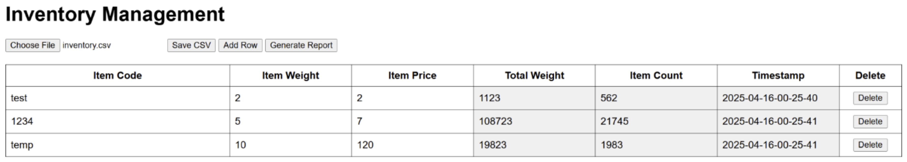

# Warehouse Inventory Tracker

James Laun and Josh Cristensen

This project monitors quantity of items using a force sensor, current and 
historical data is displayed through a web app interface.

 
## Table of Contents 

- [Overview](#overview)  

- [Hardware Components](#hardware-components)  

- [Software and Dependencies](#software-and-dependencies)  

- [Usage](#usage)  

- [Results and Demonstration](#results-and-demonstration)  

## Overview

Tracking items through a modern warehouse is a significant chellenge due to the 
scale of the facilities and the quantity of items moved. Current approaches rely 
on tracking items individually, a tedious and error-prone process. This project
aims to track items in the aggregate using scales to track when the quantity of
items in a given bay changes. This data is kept is a central server, allowing
users to view the quantity of items in all bays at any given time.

## Hardware Components

- PC (server/database)
- Raspberry Pi
- Force Sensing Resistor (Interlink Electronics FSR 406)
- Analog to Digital Converter (AD7920)
- Protoboard/jumper cables

## Software and Dependencies

- Python Libraries
    - Socket
    - Pandas
    - Cryptography
- Node.js and Dependencies
    - cors
    - express
    - node
    - path
    - npm
- HTML/CSS/JavaScript for website

## Usage

**1. Build Circuit**
- In order to obtain data, build the sensor circuit by 
connecting the FSR 406 Force Sensing Resistor to the Raspberry Pi using the 
AD7920 Analog-to-Digital converter as shown below.

**2. Establish Client/Server Connection** 
- The Raspberry Pi client must be connected to the server. The TCP/IP connection 
can be established using wifi by forwarding the used port in the router. If 
router settings are not accessible, an ethernet cable can be used instead. 
- Run the server script with `python Server.py` on the main machine, modify the AES 
key and port number if necessary. These values must match between the server and client.
- Run the client script on the Raspberry Pi with `python Client.py`, ensuring that
all static variables match the server.
    - Additionally, modify the `MASS_PER` variable to match the mass of your 
    chosen item in grams.

**3. Use Scale**
- For testing purposes, place some of your chosen items on the scale and remove 
some of them in order to generate some data. 
    - You should see terminal messages indicating that data is being sent from
    the client and received by the server whenever the number of items changes.
- Note: when placing load on the FSR, it occasionally takes a minute or two for 
the reading to rise to its stable value. This is due to the way the resistive 
membrane works and is expected behavior

**4. View Data**
- Run the website on the server machine by running `node inventory-server.js` 
in the `inventory-app` folder. This folder stores all files used by the website.
- Go to [http://localhost:3000] in your web browser to view the website.
- Load in the CSV database with `Choose File`, your data should propagate 
through the table.
- To view item history, click the `Generate Report` button
- If database entries are manually modified, resave the data with `Save CSV`

## Results and Demonstration

Testing was split into 3 Phases

**1. Data Acquisition** - To test the Data Acquisition phase, quarters of known 
mass were placed on the scale. The client script running on the Pi printed out 
the current raw analog value, total mass, and quantity of items every few seconds. 
This allows us to easily verify that the sensor is both accurately reading the mass 
of the items, and correctly counting the number of items on the scale.

In this case, 6 2-quarter units are placed on the scale. As shown in the terminal, 
the script is correctly recognizing that there are 6 units on the sensor.

**2. Data Transmission** - Testing for the Data Transmission relied on both the 
Server script running on the PC and the Client script running on the Pi. Before 
sending the TCP packet, the RPi would print both the raw data, and the encrypted 
string. 

Once received by the Server, the received message (still encrypted) as 
well as the decrypted data was printed to the PC’s terminal.

This allows us to confirm two key points. The first is that data is successfully 
being transmitted using the TCP protocol, allowing for efficient communication 
between the Pi and PC. Second, the fact that both the encrypted messages and 
decrypted data are the same for both the Server and Client indicates that the 
AES symmetric key encryption is functioning properly. This confirms the 
successful operation of the security component.

**3. CSV Database** - When the webserver is started from the command line, the 
following message is displayed to show a successful startup:

From there, you connect to the website using the localhost on port 3000 address:
http://localhost:3000

This website displays a table with all data, as well as buttons to perform various actions:

- “Choose File” button: Opens file manager and allows the selection and upload 
of a csv to the website, automatically populating the table
- “Save CSV” button: Opens file manager and allows saving any updated data to 
the csv database
- “Add Row” button: Adds a row to the end of the table
- “Delete” buttons: Deletes the row it sits on
- “Generate Report” button: Hides the table and pulls up the matplotlib graph
- “Back to Data” button: Hides the graph and pulls up the data table
- Each white colored box is able to be edited by the user and saved using the 
“Save CSV” button, and the greyed boxed are successfully generated by the program
